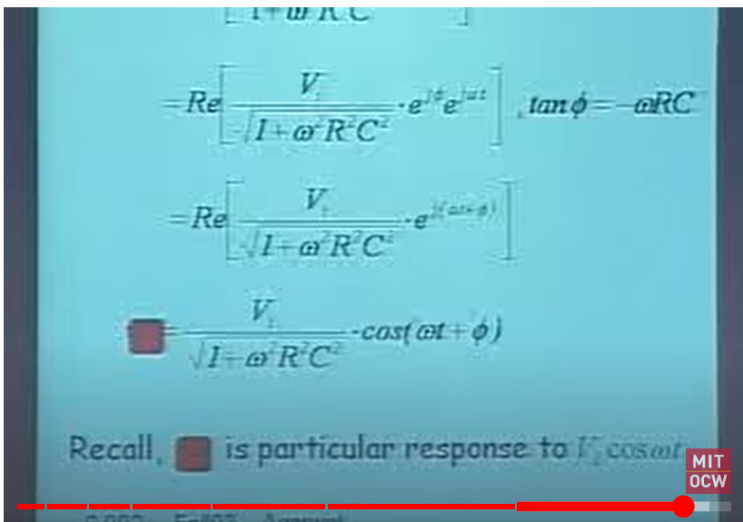
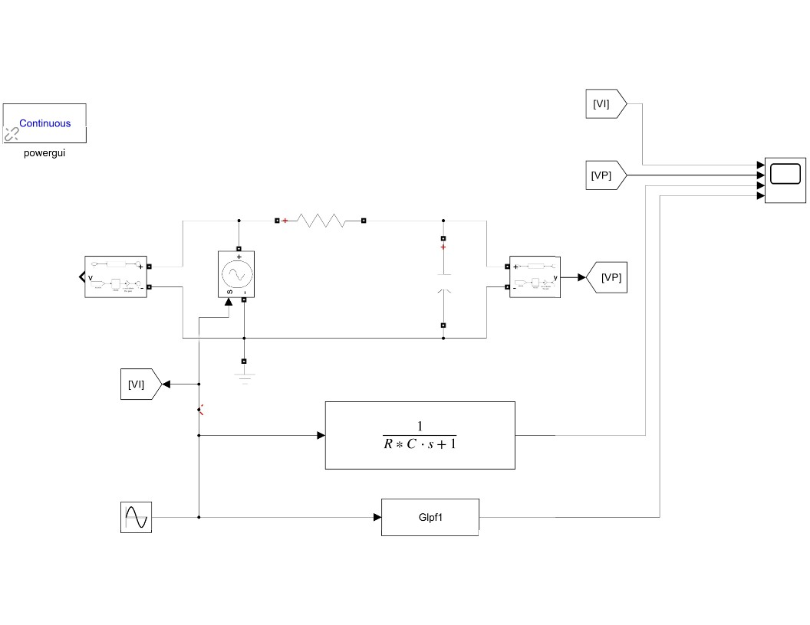
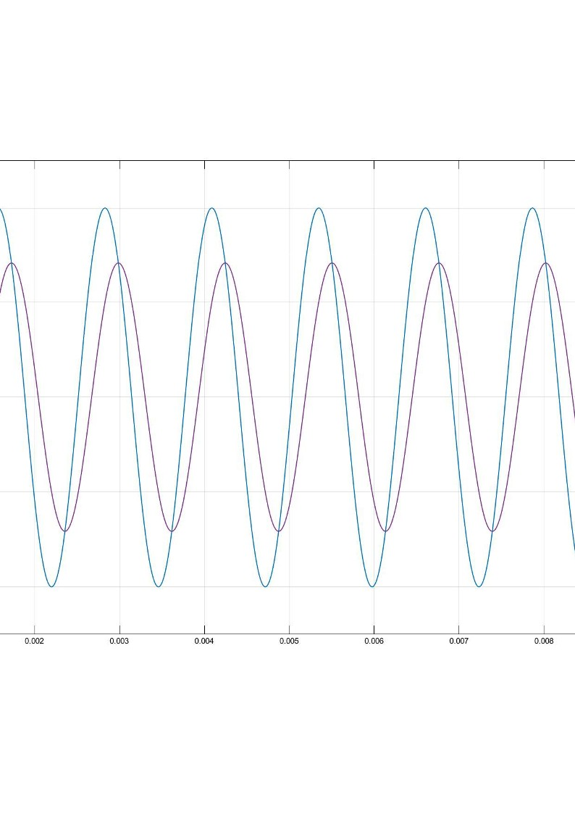

### 설정값
    진폭 : coswt
    R = 100
    C = 2e-6
    w = 2 * pi * 795  [rad/s]

### 위상차 
    약 45도
    tanΦ  = -wRC 
### 크기 
    70%

### 유도식

### RC circuit

### 결과 

### 주석
주파수를 바꾸어가면서 시험해보면 low frequency에서는 capacitor가 open circuit으로 작동하고 high frequency 에서는 capacitor가 short circuit으로 작동하는 것을 알 수 있음.

### 위의 자료는 건국대, MIT 공개강의를 참조로 하여 작성되었습니다. 
